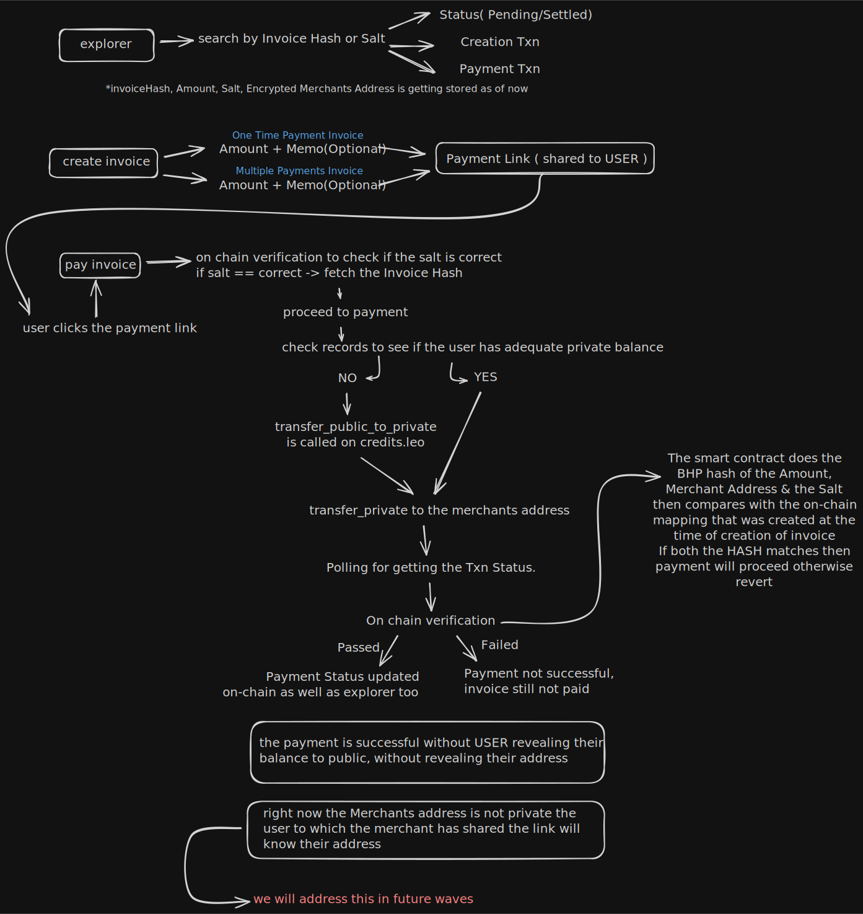

# NullPay

**Privacy-first payment protocol built on Aleo blockchain with zero-knowledge proofs**

NullPay is a decentralized invoice and payment system that leverages Aleo's zero-knowledge cryptography to enable private, verifiable transactions. Merchants can create invoices without revealing sensitive information on-chain, and payers can settle invoices while maintaining complete anonymity.

**Live Application:** [https://null-pay.vercel.app/](https://null-pay.vercel.app/)  
**Smart Contract:** [`zk_pay_proofs_privacy_v7.aleo`](https://testnet.explorer.provable.com/program/zk_pay_proofs_privacy_v7.aleo)

---

## NullPay Architecture



---

## Features

### Core Capabilities
- **Zero-Knowledge Invoices**: Merchant addresses and amounts are hashed on-chain using BHP256, preserving privacy
- **Private Transfers**: Payments executed via Aleo's `transfer_private`, hiding payer identity and balances
- **Standard Invoices**: Single-payment invoices that close upon settlement
- **Multi Pay Campaigns**: Multi-contributor invoices with individual payment receipts
- **Tamper-Proof Verification**: Mathematical hash verification prevents invoice manipulation
- **Encrypted Metadata**: Off-chain data encrypted with AES-256-GCM for additional security
- **Payment Receipts**: Unique receipt keys generated via cryptographic commitments for multi-pay tracking

### User Experience
- **Wallet Integration**: Seamless connection with Aleo wallet adapters (Leo Wallet, Puzzle Wallet, etc.)
- **Invoice Explorer**: Real-time tracking of invoice status and transaction history
- **Merchant Dashboard**: Track created invoices, payment status, and settlement options
- **Responsive Design**: Premium glassmorphism UI with fluid animations

---

## Architecture

NullPay consists of three main layers:

### Layer 1: Frontend (React + TypeScript)
The client-side application handles:
- Salt generation using `crypto.getRandomValues()` (128-bit entropy)
- Wallet adapter integration for transaction signing
- Invoice hash computation (client-side verification)
- Transaction submission to Aleo network
- Record management for private payments

### Layer 2: Smart Contract (Leo)
The on-chain protocol `zk_pay_proofs_privacy_v7.aleo` enforces:
- Hash integrity verification (`assert_eq(computed_hash, stored_hash)`)
- Invoice status management (0 = Open, 1 = Settled)
- Conditional payment logic (Standard vs Multi Pay)
- Replay protection via payment receipt tracking
- Private transfers through `credits.aleo`

### Layer 3: Backend (Node.js + Supabase)
The indexer and database layer provides:
- Fast invoice lookups without querying blockchain repeatedly
- AES-256-GCM encrypted storage for merchant/payer addresses
- Transaction history aggregation
- RESTful API for frontend data access

**Data Flow:**
```
Merchant → Frontend → Smart Contract → Blockchain
                ↓
           Backend DB (Encrypted)
                ↓
           Payer → Frontend → Verify Hash → Pay Invoice
```

---

## Technology Stack

**Blockchain:**
- Aleo Testnet (Privacy-preserving L1)
- Leo Programming Language (Smart contract development)
- BHP256 Hash Function (ZK-optimized hashing)

**Frontend:**
- React 18 with TypeScript
- Vite (Build tool)
- Tailwind CSS (Styling)
- Framer Motion (Animations)
- React Router (Navigation)
- @provablehq/aleo-wallet-adaptor-react (Wallet integration)

**Backend:**
- Node.js with Express
- Supabase (PostgreSQL database)
- AES-256-GCM Encryption
- CORS-enabled REST API

**Development Tools:**
- Leo CLI (Contract compilation)
- npm/yarn (Package management)
- Git (Version control)

---

## Getting Started

### Prerequisites

- Node.js (v18 or higher)
- npm or yarn
- Leo CLI (for contract development)
- Aleo Wallet (Leo Wallet, Puzzle Wallet, or compatible)
- Supabase Account (for backend database)

### Installation

**1. Clone the repository:**
```bash
git clone https://github.com/your-org/AleoZKPay.git
cd AleoZKPay
```

**2. Install frontend dependencies:**
```bash
cd frontend
npm install
```

**3. Install backend dependencies:**
```bash
cd ../backend
npm install
```

**4. Compile smart contract (optional):**
```bash
cd ../contracts/zk_pay
leo build
```

### Environment Setup

**Frontend (`.env` in `frontend/`):**
```env
VITE_PROGRAM_ID=zk_pay_proofs_privacy_v7.aleo
VITE_BACKEND_URL=http://localhost:3000
```

**Backend (`.env` in `backend/`):**
```env
SUPABASE_URL=your_supabase_url
SUPABASE_ANON_KEY=your_supabase_anon_key
ENCRYPTION_KEY=your_64_char_hex_key
PORT=3000
```

**Generate an encryption key:**
```bash
node -e "console.log(require('crypto').randomBytes(32).toString('hex'))"
```

**5. Start the backend:**
```bash
cd backend
npm start
```

**6. Start the frontend:**
```bash
cd frontend
npm run dev
```

The application will be available at `http://localhost:5173`

---

## Project Structure

```
AleoZKPay/
├── contracts/
│   └── zk_pay/
│       └── src/
│           └── main.leo          # Smart contract (v7)
├── frontend/
│   ├── src/
│   │   ├── components/           # Reusable UI components
│   │   ├── hooks/                # Custom React hooks
│   │   │   ├── useCreateInvoice.ts
│   │   │   └── usePayment.ts
│   │   ├── pages/                # Route pages
│   │   │   ├── CreateInvoice.tsx
│   │   │   ├── PaymentPage.tsx
│   │   │   ├── Explorer.tsx
│   │   │   ├── Profile.tsx
│   │   │   ├── Privacy.tsx
│   │   │   └── Docs.tsx
│   │   ├── services/
│   │   │   └── api.ts            # Backend API client
│   │   ├── utils/
│   │   │   └── aleo-utils.ts     # Salt generation, hash fetching
│   │   └── App.tsx
│   └── package.json
├── backend/
│   ├── index.js                  # Express server
│   ├── encryption.js             # AES-256-GCM encryption
│   └── package.json
├── docs/
│   └── future_wave.md            # Roadmap
└── README.md
```

---

## Smart Contract

The core contract `zk_pay_proofs_privacy_v7.aleo` is deployed on Aleo Testnet.

**Explorer Link:** [https://testnet.explorer.provable.com/program/zk_pay_proofs_privacy_v7.aleo](https://testnet.explorer.provable.com/program/zk_pay_proofs_privacy_v7.aleo)

### Transitions

#### 1. `create_invoice`
Creates a new invoice (Standard or Multi Pay).

**Inputs:**
- `merchant: address` (private) - Merchant's Aleo address
- `amount: u64` (private) - Invoice amount in microcredits
- `salt: field` (private) - Random 128-bit salt
- `expiry_hours: u32` (public) - Invoice expiry (0 = no expiry)
- `invoice_type: u8` (public) - 0 = Standard, 1 = Multi Pay

**Outputs:**
- `invoice_hash: field` (public) - BHP256-based hash of merchant + amount + salt

**On-chain Storage:**
- `invoices[hash]` → `{ expiry_height, status: 0, invoice_type }`
- `salt_to_invoice[salt]` → `hash`

#### 2. `pay_invoice`
Pays an existing invoice.

**Inputs:**
- `pay_record: credits` - Private credit record for payment
- `merchant: address` - Merchant address from invoice link
- `amount: u64` - Amount from invoice link
- `salt: field` - Salt from invoice link
- `payment_secret: field` (private) - Unique secret for receipt generation
- `message: field` (public) - Optional public message (e.g., invoice_hash)

**Behavior:**
- **Standard Invoice (type 0):** Asserts `status == 0`, then sets `status = 1` (closed)
- **Multi Pay Invoice (type 1):** Creates receipt key `BHP256::commit_to_field(payment_secret, salt_scalar)`, stores in `payment_receipts[receipt_key] = amount`. Invoice remains open.

**Security:**
- Verifies `computed_hash == salt_to_invoice[salt]`
- Prevents replay attacks (asserts receipt key doesn't exist)

#### 3. `settle_invoice`
Allows merchant to manually close a multi-pay campaign.

**Inputs:**
- `salt: field` (public) - Invoice salt
- `amount: u64` (private) - Invoice amount (for hash verification)

**Authorization:**
- Only merchant can call (verified via `self.caller` hash reconstruction)

**Effect:**
- Sets `status = 1`, preventing further payments

### Data Structures

```leo
struct InvoiceData {
    expiry_height: u32,    // Block height for expiry (0 = no expiry)
    status: u8,            // 0 = Open, 1 = Settled
    invoice_type: u8       // 0 = Standard, 1 = Multi Pay
}

mapping invoices: field => InvoiceData;
mapping salt_to_invoice: field => field;
mapping payment_receipts: field => u64;  // Multi Pay payment tracking
```

---

## Backend API

The backend runs on Express and provides encrypted invoice storage.

**Base URL:** `http://localhost:3000` (or production URL)

### Endpoints

#### `GET /api/invoices`
Fetch all invoices (decrypted).

**Query Parameters:**
- `status` (optional) - Filter by status (PENDING, SETTLED)
- `limit` (optional) - Limit results (default: 50)
- `merchant` (optional) - Filter by merchant address

**Response:**
```json
[
  {
    "invoice_hash": "123456field",
    "merchant_address": "aleo1...",
    "amount": 1000000,
    "status": "PENDING",
    "created_at": "2026-01-30T10:00:00Z"
  }
]
```

#### `GET /api/invoice/:hash`
Fetch a single invoice by hash.

**Response:**
```json
{
  "invoice_hash": "123456field",
  "merchant_address": "aleo1...",
  "payer_address": "aleo1...",
  "amount": 1000000,
  "memo": "Payment for services",
  "status": "SETTLED",
  "invoice_transaction_id": "at1...",
  "payment_tx_ids": ["at1..."],
  "salt": "999999field"
}
```

#### `POST /api/invoices`
Create a new invoice entry.

**Request Body:**
```json
{
  "invoice_hash": "123456field",
  "merchant_address": "aleo1...",
  "amount": 1000000,
  "memo": "Optional memo",
  "status": "PENDING",
  "invoice_transaction_id": "at1...",
  "salt": "999999field",
  "invoice_type": 0
}
```

**Note:** `merchant_address` is encrypted before storage.

#### `PATCH /api/invoices/:hash`
Update invoice status after payment.

**Request Body:**
```json
{
  "status": "SETTLED",
  "payment_tx_ids": ["at1..."],
  "payer_address": "aleo1...",
  "block_settled": 12345
}
```

#### `GET /api/invoices/merchant/:address`
Fetch all invoices for a specific merchant.

**Response:** Array of decrypted invoices.

---

## Frontend Application

### Pages

**Home / Create Invoice (`/`)**
- Merchant creates Standard or Multi Pay invoice
- Generates 128-bit random salt
- Submits `create_invoice` transaction
- Displays shareable payment link

**Payment Page (`/pay`)**
- Verifies invoice hash on-chain
- Checks invoice status (can't pay if settled)
- Selects suitable private record
- Executes `pay_invoice` transaction
- Updates backend after confirmation

**Explorer (`/explorer`)**
- Lists recent invoices from backend
- Shows invoice status, amounts, transaction IDs
- Links to Aleo block explorer

**Profile (`/profile`)**
- Displays merchant-specific invoices
- Allows settlement of multi-pay campaigns
- Shows payment history

**Privacy (`/privacy`)**
- Explains zero-knowledge invoice mechanism
- Details encryption and hashing methods
- Describes anti-fraud verification

**Docs (`/docs`)**
- Technical documentation
- Smart contract specifications
- API reference

### Key Hooks

**`useCreateInvoice`**
- Manages invoice creation flow
- Polls transaction status (4 fallback strategies)
- Saves to backend after on-chain confirmation

**`usePayment`**
- Manages payment flow
- Handles record selection and decryption
- Supports `convert_public_to_private` if needed
- Updates invoice status in backend

---

## Development

**Run frontend in development mode:**
```bash
cd frontend
npm run dev
```

**Build frontend for production:**
```bash
npm run build
npm run preview  # Test production build
```

**Run backend:**
```bash
cd backend
npm start
```

**Compile smart contract:**
```bash
cd contracts/zk_pay
leo build
```

**Deploy contract (Leo CLI):**
```bash
leo deploy --network testnet --program zk_pay_proofs_privacy_v7.aleo
```

---

## Security

### On-Chain Privacy
- **Merchant Address:** Hashed with BHP256 before storage
- **Invoice Amount:** Hashed with BHP256 before storage
- **Salt:** 128-bit entropy (2^128 search space)
- **Payer Identity:** Hidden via `transfer_private`
- **Payment Receipts:** Commitment scheme prevents receipt forgery

### Off-Chain Security
- **AES-256-GCM Encryption:** Merchant and payer addresses encrypted at rest
- **Authenticated Encryption:** GCM mode provides integrity and confidentiality
- **Environment Variables:** Encryption keys stored securely
- **HTTPS Required:** Production deployments must use HTTPS

### Attack Mitigations
- **Replay Protection:** Payment receipts prevent duplicate payments with same secret
- **Hash Verification:** `assert_eq(computed_hash, stored_hash)` prevents tampering
- **Double-Spend Prevention:** Aleo's serial number system prevents record reuse
- **Expiry Enforcement:** Block height checks prevent payment of expired invoices

---

## Future Roadmap

Planned features for upcoming releases:

1. **Treasury Management:** Multi-signature wallets for merchant payouts
2. **Record Privacy:** Store amounts as private records instead of public fields
3. **SDK:** JavaScript/TypeScript SDK for third-party integrations
4. **Expiry Enforcement:** Automatic invoice expiration
5. **Categorization:** Tag-based invoice organization
6. **Mobile App:** React Native application
7. **Enterprise Features:** Bulk invoicing, reporting, webhooks

See [`docs/future_wave.md`](./docs/future_wave.md) for detailed roadmap.

---

## Contributing

Contributions are welcome! Please follow these guidelines:

1. Fork the repository
2. Create a feature branch (`git checkout -b feature/your-feature`)
3. Commit your changes with clear messages
4. Push to your fork (`git push origin feature/your-feature`)
5. Open a Pull Request

**Code Style:**
- Frontend: ESLint + Prettier
- Backend: Standard JavaScript conventions
- Leo: Follow Aleo's Leo style guide

**Testing:**
- Write unit tests for new features
- Test on Aleo Testnet before production
- Verify encryption/decryption functions

---

## License

This project is licensed under the MIT License. See `LICENSE` file for details.

---

## Acknowledgments

Built with Aleo's privacy-preserving blockchain technology.

**Resources:**
- [Aleo Documentation](https://developer.aleo.org/)
- [Leo Language Reference](https://developer.aleo.org/leo/)
- [Aleo Explorer](https://testnet.explorer.provable.com/)

**Contact:**
For questions or support, please open an issue on GitHub.